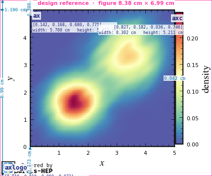
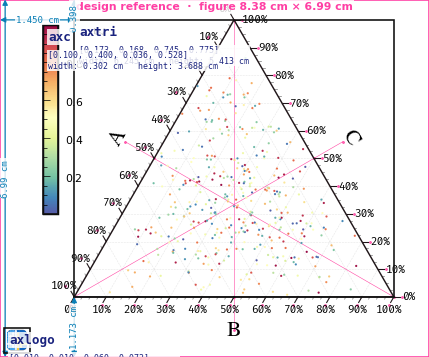

# Style Cards and Layout

A figure's `style` selects a **style card** — a JSON file that fixes the figure size, the exact
position of every axis, the fonts, ticks, and the per-method default styling. You reference a
card by `[family, variant]`:

```yaml
Figures:
  - name: my_figure
    style: [a4paper_2x1, rectcmap]    # family, variant
```

Picking a card is all most users need. This page explains what a card contains and how to read
its dimensions — and the [design-reference debug mode](#design-reference-debug-mode) that draws
those dimensions onto the figure.

## Each style is a JSON card

The token `[family, variant]` resolves to a JSON file under the Jarvis-PLOT package
(`jarvisplot/cards/<family>/<variant>.json`). A card has two top-level blocks:

```json
{
  "Frame": { "figure": { "figsize": [3.3, 2.75] },
             "axes":   { "ax": {"rect": [0.142, 0.168, 0.68, 0.775]},
                         "axc": {"rect": [0.827, 0.182, 0.036, 0.746]},
                         "axlogo": {"rect": [0.01, 0.01, 0.06, 0.072]} },
             "ax":  { "...frame / grid / ticks / labels..." },
             "axc": { "...colorbar styling..." } },
  "Style": { "scatter": {"...defaults..."}, "voronoi": {"..."} }
}
```

| Block | Owns |
|-------|------|
| `Frame.figure.figsize` | Figure size in **inches** `[width, height]` |
| `Frame.axes.<id>.rect` | Each axis box as `[left, bottom, width, height]` in **figure fractions** |
| `Frame.ax` / `Frame.axc` / `Frame.axtri` | Default frame, grid, ticks and labels for those axes |
| `Style.<method>` | Default keyword args for each [plot method](methods.md) |

Your figure's `frame` and per-layer `style` are deep-merged **over** these card defaults, so you
only override what you need — see [Frame](axes-rect-ternary.md) and [Figures and Layers](figures-layers.md).

## Reading the dimensions

Each axis box is stored as a fraction of the figure, and the figure size is in inches. To get
centimetres:

```
size_cm = fraction × figsize_inch × 2.54
```

For example, with `figsize: [3.3, 2.75]` (= 8.38 cm × 6.99 cm) and `ax.rect = [0.142, 0.168, 0.68, 0.775]`:

- main-axes width  = `0.68 × 3.3 × 2.54`  ≈ **5.70 cm**
- main-axes height = `0.775 × 2.75 × 2.54` ≈ **5.41 cm**
- left margin      = `0.142 × 3.3 × 2.54` ≈ **1.19 cm**

You rarely compute these by hand — the [debug mode](#design-reference-debug-mode) draws them for you.

## Axis ids

The axis ids a card provides are exactly the keys layers target with `axes:` and colorbars
attach to with `colorbar:`.

| Id | Purpose |
|----|---------|
| `ax` | Main rectangular axes |
| `axc` | Colorbar axes (present in `*cmap` variants) |
| `axtri` | Ternary axes (present in `Ternary*` variants) |
| `axlogo` | The "Powered by Jarvis-HEP" logo inset (hidden with `--print`) |
| `ax0`, `ax1`, … | Panels in multi-panel cards |

## Families and variants

| Family | Variants | Layout |
|--------|----------|--------|
| `a4paper_2x1` | `rect`, `rectcmap`, `Ternary`, `TernaryCmap`, `rect_5x1`, `dynesty_runplot` | A4, 2 columns × 1 row |
| `a4paper_4x1` | `rect`, `rectcmap`, `Ternary`, `TernaryCmap` | A4, 4 columns × 1 row |
| `a4paper_1x1` | `Ternary` | A4, single panel |
| `gambit_2x1` | `rectcmap`, `Ternary`, `TernaryCmap` | GAMBIT collaboration style |
| `gambit_1x1` | `Ternary` | GAMBIT single panel |

<aside>
ℹ️
<strong>Variant tokens are case-sensitive</strong>

The rectangular variants are lower-case (<code>rect</code>, <code>rectcmap</code>); the ternary
variants are capitalized (<code>Ternary</code>, <code>TernaryCmap</code>). The <code>*cmap</code>
variants reserve space for a colorbar axis (<code>axc</code>); the plain variants do not.

</aside>

## Design-reference debug mode

Set `debug: true` on a figure to render a **dimension overlay** on top of the finished plot.
Every axis defined by the card is outlined and annotated with its name, its
`rect = [left, bottom, width, height]`, and its width/height in centimetres; the primary axes
also gets margin dimension lines, and the colorbar gets a gap dimension.

```yaml
Figures:
  - name: my_figure
    debug: true                        # ← draw the design-reference overlay
    style: [a4paper_2x1, rectcmap]
    frame: { ... }
    layers: [ ... ]
```

A rectangular card with a colorbar:



A ternary card:



What the overlay shows:

- **pink border + caption** — the figure outline and its size in cm (from `figure.figsize`)
- **black boxes** — each axis at its `rect` position
- **navy text** — the axis id, its `[left, bottom, width, height]`, and its cm size
- **blue dimension lines** — the figure height, the primary axes' left/top/bottom margins, and
  the gap to the colorbar

The overlay is purely an annotation layer added just before saving — it never alters the data
plot, and it is only drawn when `debug: true`. Use it to read off the numbers you would put into
a custom card, or to verify a `frame` override moved an axis where you expected.

---

See also: [Figures and Layers](figures-layers.md) · [Frame: Axes and Colorbar](axes-rect-ternary.md) · [Figure Gallery](gallery.md)
