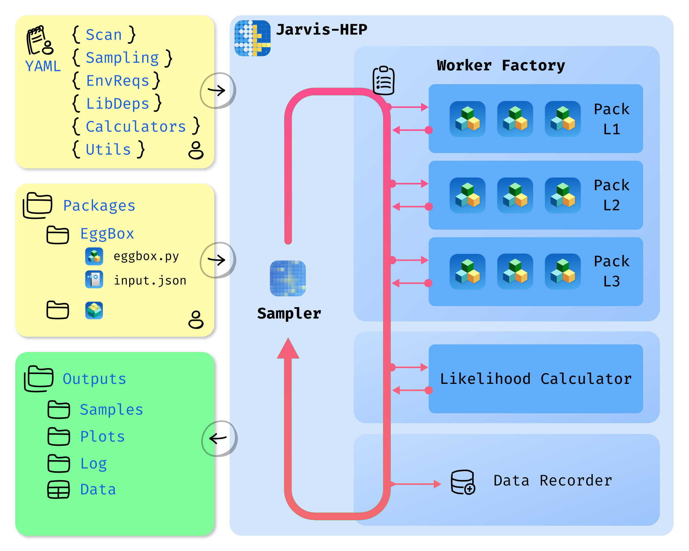
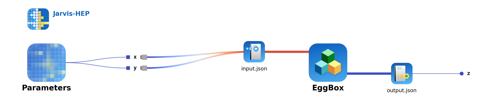
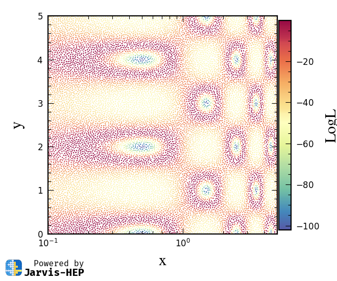
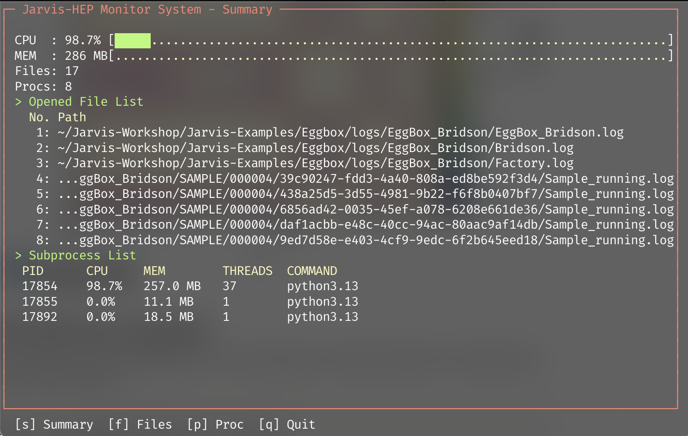

# From 0 to 1: Common workflow

## Design Philosophy



This diagram summarizes the end-to-end Jarvis workflow: you prepare the packages, write a scan card (Task YAML), and choose a sampler. Jarvis orchestrates the execution—including environment requirements and calculator backends—runs the scan, and produces structured outputs that can be post-processed and visualized (e.g., with Jarvis-PLOT).

**Jarvis acts as a sampling manager.** 

1. It builds a Worker factory based on your task YAML file and the packages you provided. 
2. Jarvis monitors the sampler and factory, assigns each sample from the sampler as a task, and submits tasks to the factory asynchronously—waiting for each result before submitting the next one. 
3. the Worker factory accepts each task and executes calculations according to the calculation flowchart. 
4. all results—including samples, logs, and data files—are collected in the output folder. 

Users can then process data using their own tools or visualize it using **JarvisPLOT** (when it is available). 

## Step-by-step (from 0 to 1)

### 1) Create a project scaffold

Create a new project folder with the standard layout:

```bash
Jarvis --mkproject MyProject
```

You should see a folder :folders: `MyProject` contains (at least):

```
📁 MyProject
		├── 📁 bin
		│      ├──  📋 quickstart_csv_operas.yaml
		│      └──  📋 quickstart_mcmc_operas.yaml
		├── 📁 data
		│      └──  🗃️ points.csv
		├── 📁 deps
		│      └──  📋 environment_default.yaml
		├── 📋 jarvis.project.yaml
		└── 📖 README.md
```

- 📁 `bin` : YAML task cards live here.
- 📁 `data` : External data files that may be helpful to your project but are not directly related to Jarvis scan tasks.
- 📁 `deps` : Packages and everything related to Jarvis scan tasks. Jarvis creates a default environment requirement list card here, :yaml: `enviroment_default.yaml` .

### 2) Edit the YAML task card

You can find example YAML task cards in the `Eggbox` project ([Eggbox: a minimal black box example ](https://www.notion.so/Eggbox-a-minimal-black-box-example-324b3a9dafc580d2b72bd0318e1512c2?pvs=21)). For a detailed reference, see [Task YAML Structure](https://www.notion.so/Task-YAML-Structure-2efa5abf356449c7ba5da14090b1e160?pvs=21).

We'll skip editing for now and use the `Eggbox` example in the next step. Download it via the Jarvis project engine, see [Command Line Tools](https://www.notion.so/Command-Line-Tools-1a4adeac12864a929506f532e4016e98?pvs=21) 

```
Jarvis project fetch Eggbox 
```

### 3) Run the scan (default mode)

Navigate to the Eggbox directory and run Jarvis on the task card:

```bash
cd Eggbox
Jarvis ./bin/Example_Bridson.yaml
```

The interface during execution is shown below. Here, following the actual execution sequence, I'll explain what Jarvis does internally. Generally, users don't need to pay much attention to Jarvis's output—the terminal display shows only the status of the sampler and factory. I'll break them into pieces and explain each briefly below:

- A Jarvis-HEP icon and version information appear. This means the Jarvis logging system has launched.
    
```bash
 Jarvis-HEP 
	-> 03-17 15:46:24.644 - [WARNING] >>> 

 ███ ███         ██╗ █████╗ ██████╗ ██╗   ██╗██╗███████╗ 
█████████        ██║██╔══██╗██╔══██╗██║   ██║██║██╔════╝ 
█══███══█        ██║███████║██████╔╝██║   ██║██║███████╗ 
╚╗█████╔╝   ██   ██║██╔══██║██╔══██╗╚██╗ ██╔╝██║╚════██║ 
 ╚█═══█╝    ╚█████╔╝██║  ██║██║  ██║ ╚████╔╝ ██║███████║ 
  █████      ╚════╝ ╚═╝  ╚═╝╚═╝  ╚═╝  ╚═══╝  ╚═╝╚══════╝ 
________________________________________________________
=== Jarvis-HEP ===
     Just a Robust and Versatile Interface Suite for HEP  
          Author:   Pengxuan Zhu, Erdong Guo. 
          Version:  1.6.9 
 Jarvis-HEP 
	-> 03-17 15:46:24.645 - [WARNING] >>> 
Jarvis-HEP logging system initialized successful! 
```
    
- Check YAML via schema parser system. The following output means you have written the YAML task card with correct Jarvis-HEP grammar.
    
```bash
 Jarvis-HEP.ConfigParser 
	-> 03-17 15:46:26.128 - [WARNING] >>> 
Validation successful. The input YAML file meets the schema requirement. 
```
    
- Successfully initialized the sampler (using the Bridson sampling method).
    
```bash

 Jarvis-HEP.Bridson 
	-> 03-17 15:46:26.136 - [WARNING] >>> 
Sampling method initializaing ... 
 Jarvis-HEP.Bridson 
	-> 03-17 15:46:26.142 - [WARNING] >>> 
Sample archive worker started
Field | Value                                                                   
----- | ---------------------------
pid   | 83483                                                                    
 Jarvis-HEP.Bridson 
	-> 03-17 15:46:26.143 - [WARNING] >>> 
Initializing the Bridson Sampling 
```
    
- Calculation flow was successfully parsed, and Worker factory is successfully initialized. Eggbox instances are reloaded here. This happens when you run a repeated scan task, avoiding recompilation of external packages to save time.
    
```bash
 Jarvis-HEP.Factory 
	-> 03-17 15:46:29.317 - [WARNING] >>> 
Building the factory for workers ... 
 Jarvis-HEP.Factory.Manager 
	-> 03-17 15:46:29.317 - [WARNING] >>> 
Manager adding ModulePool EggBox.  
 Jarvis-HEP.Workflow.EggBox 
	-> 03-17 15:46:29.317 - [WARNING] >>> 
Trying to loac the installed instance information for mudule -> EggBox 
 Jarvis-HEP.Workflow.EggBox 
	-> 03-17 15:46:29.326 - [WARNING] >>> 
Instance reloaded! 
```
    
- The factory builds the worker pipeline for the task, and the calculation flowchart is plotted automatically. Factory is ready.
    
```bash
 Jarvis-HEP 
	-> 03-17 15:46:28.914 - [WARNING] >>> 
Draw workflow chart into /Users/p.zhu/Jarvis-Workshop/Jarvis-Examples/Eggbox/images/EggBox_Bridson/flowchart.png 
 Jarvis-HEP.Bridson 
	-> 03-17 15:46:29.597 - [WARNING] >>> 
WorkerFactory is ready for Bridson sampler 
```
    

    
    Calculation flowchart for Eggbox. For each sample, the sampler generates two values, x and y. The factory then calls the eggbox module to calculate the z value. 
    
- Sampling started. Running state information is shown periodically.
    
```bash
 Jarvis-HEP.Bridson 
	-> 03-17 15:46:31.358 - [WARNING] >>> 
10‰ of 101/10028 samples submited in 00:00:01.753 

...

 Jarvis-HEP.Factory 
	-> 03-17 15:48:01.154 - [WARNING] >>> 
Submitted 5000 tasks, time for last 1000 tasks: 00:00:18.566, total time: 00:01:31.838 

...
```
    
- Sampling finished:
  
A.  Sampler stops sampling.
        
```bash
 Jarvis-HEP.Bridson 
	-> 03-17 15:49:34.406 - [WARNING] >>> 
1000‰ of 10028/10028 samples submited in 00:03:04.801 
```
        
B.  Data writer stopped recording, displayed the summary, and converted the HDF5 files into human-readable CSV format.
        
```bash
Ϡ Jarvis-HEP.hdf5-Writter 
	-> 03-17 15:49:34.573 - [WARNING] >>> 
Global HDF5 writer stopped 
Ϡ Jarvis-HEP.hdf5-Writter 
	-> 03-17 15:49:34.574 - [WARNING] >>> 
Global writer summary
Field           | Value                                                         
--------------- | ----------------------------------------------------
enqueued        | 10028                                            
flushed         | 10028                                               
flush_count     | 20                                            
max_queue_depth | 5

Ϡ Jarvis-HEP.hdf5-Writter 
	-> 03-17 15:49:35.243 - [WARNING] >>> 
Converted HDF5 data to CSV at -> /Users/p.zhu/Jarvis-Workshop/Jarvis-Examples/Eggbox/outputs/EggBox_Bridson/DATABASE/samples.0.csv. 
```
        
C.  Factory shuts down with a summary information table. The factory handled 54 samples (tasks) per second. If you use the Operas version of the Eggbox example, you'll see a significant performance boost because Operas registers Eggbox in memory, eliminating file I/O overhead.
        
```bash
 Jarvis-HEP.Factory 
	-> 03-17 15:49:35.244 - [WARNING] >>> 
Factory shutdown summary
Field      | Value                                                   
---------- | ---------------------------------------------------
submitted  | 10028                                                 
ok         | 10028                                                 
failed     | 0                                                     
unfinished | 0                                                     
tail_tasks | 28                                                   
total_time | 00:03:05.929                                           
avg_rate   | 53.93 tasks/s        
```
        

After the sampling is finished, the directory tree is like 

```bash
Eggbox
├── bin
│   ├── Example_Bridson_Operas.yaml
│   └── Example_Bridson.yaml
├── calculators
│   └── runtime
│       └── program
│           └── EggBox
│               ├── 001
│               │   ├── eggbox.py
│               │   ├── input.json
│               │   ├── Installation_EggBox-001.log
│               │   └── output.json
│            ....
│               └── EggBox_instance_info.json
├── deps
├── images
│   └── EggBox_Bridson
│       └── flowchart.png
├── logs
│   └── EggBox_Bridson
│       ├── Bridson.log
│       ├── EggBox_Bridson.log
│       └── Factory.log
├── outputs
│   └── EggBox_Bridson
│       ├── DATABASE
│       │   ├── archive_manifest.jsonl
│       │   ├── running.json
│       │   ├── samples.0.csv
│       │   ├── samples.0.hdf5
│       │   └── samples.schema.json
│       ├── Example_Bridson.pkl
│       ├── run_summary.csv
│       ├── run_summary.json
│       ├── run_summary.txt
│       └── SAMPLE
│           ├── 000001.tar.gz
│           ...
│           └── 000050.tar.gz
└── README.md

... directories, ... files
```

- 📁 `calculator` : The folder containing HEP Package instances, each of which will be called by the Factory. In the Eggbox examples, this folder is created automatically by the factory. Users can use a different name—this is just a conventional choice.
- 📁 `logs`: Detailed logging files for the sampler and factory.
- 📁  `output` : The `output` folder holds scan task results and contains two subfolders: `DATABASE` and `SAMPLE`. The former records the dataset generated by the scan task; the latter contains detailed information for all samples. The `SAMPLE` folder is compressed, with complete information recorded in the `DATABASE/archive_manifest.jsonl` file.

### 4) Convert data files to CSV (optional)

Before the scan finishes, you can convert the HDF5 format data into CSV output in a new terminal. This operation will not affect the Jarvis scanning process. This allows you to check the data while Jarvis is running a time-consuming task and use `JarvisPLOT` to visualize the CSV files during the scan. 

```bash
Jarvis ./bin/Example_Bridson.yaml --convert
```

### 5) Generate plotting config and make plots (optional)

Generate a Jarvis-PLOT YAML configuration from the Jarvis-HEP task card:

```bash
Jarvis ./bin/Example_Bridson.yaml --plot

 Jarvis-HEP 
	-> 03-17 16:47:16.359 - [WARNING] >>> 

 ███ ███         ██╗ █████╗ ██████╗ ██╗   ██╗██╗███████╗ 
█████████        ██║██╔══██╗██╔══██╗██║   ██║██║██╔════╝ 
█══███══█        ██║███████║██████╔╝██║   ██║██║███████╗ 
╚╗█████╔╝   ██   ██║██╔══██║██╔══██╗╚██╗ ██╔╝██║╚════██║ 
 ╚█═══█╝    ╚█████╔╝██║  ██║██║  ██║ ╚████╔╝ ██║███████║ 
  █████      ╚════╝ ╚═╝  ╚═╝╚═╝  ╚═╝  ╚═══╝  ╚═╝╚══════╝ 
________________________________________________________
=== Jarvis-HEP ===
     Just a Robust and Versatile Interface Suite for HEP  
          Author:   Pengxuan Zhu, Erdong Guo. 
          Version:  1.6.9 
 Jarvis-HEP 
	-> 03-17 16:47:16.359 - [WARNING] >>> 
Jarvis-HEP logging system initialized successful! 
 Jarvis-PLOT 
	-> 03-17 16:47:16.365 - [WARNING] >>> 
Generate JarvisPLOT YAML for Example_Bridson 
 Jarvis-PLOT 
	-> 03-17 16:47:16.367 - [WARNING] >>> 
JarvisPLOT YAML generated: 
/Users/p.zhu/Jarvis-Workshop/Jarvis-Examples/Eggbox/images/EggBox_Bridson/EggBox_Bridson.yaml 
 Jarvis-PLOT 
	-> 03-17 16:47:16.367 - [WARNING] >>> 
Render with external Jarvis-PLOT CLI: 
jplot /Users/p.zhu/Jarvis-Workshop/Jarvis-Examples/Eggbox/images/EggBox_Bridson/EggBox_Bridson.yaml %                                      
```

Use Jarvis-PLOT to visualize the dataset. For more details, see the Jarvis-PLOT documentation.

```bash
jplot ./images/EggBox_Bridson/EggBox_Bridson.yaml 
```

This will generate plots saved in the directory `image/EggBox_Bridson/scatter_x__y.png`



### 6) Monitoring a runing job (optional)

Jarvis-HEP allows you to monitor the currently running job. For the above example, open a new terminal and use 

```bash
Jarvis ./bin/Example_Bridson.yaml --monitor
```



## Congratulations, you made it from 0 to 1! 

The above workflow demonstrates a complete cycle from project creation, task YAML preparation/reuse, scan initiation, to monitoring and result export/visualization. In practice, you only need to focus on the task card and output directory—Jarvis handles sampling scheduling, Worker execution, and result archiving, making large-scale parameter scans more stable, reproducible, and easier to post-process.