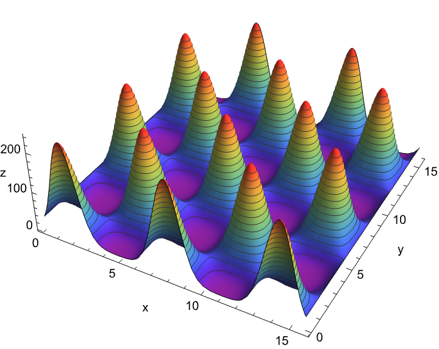

# Eggbox: a minimal black box example

This tutorial is for a HEP researcher who wants to write a Jarvis-HEP YAML file from scratch.

We use the simple `EggBox` calculator as a stand-in for a real physics package. The goal is not the EggBox function itself. The goal is to learn the authoring pattern you will reuse for your own model.

## What You Will Learn

By the end of this page, you will know how to write a YAML card that defines parameters, runs a calculator, extracts observables, and evaluates a likelihood.

The same pattern applies to real HEP tools such as spectrum generators, dark matter codes, and collider recasting pipelines.

## The Black-Box Model

Jarvis-HEP treats your physics code as a black box.

For each sampled point, Jarvis-HEP does the following:

1. writes one input file
2. runs your code
3. reads one output file
4. stores the requested observables
5. evaluates the `LogLikelihood`

For the EggBox example, the external program reads `input.json` and writes `output.json`.

The function is:

```
z(x, y) = (sin(x) * cos(y) + 2)^5
```

We pretend that an experiment measures:

```
z = 100 +/- 10
```

So the scan goal is to find parameter points where the predicted `z` value is compatible with that target.



## Before You Write YAML

Think in this order:

1. Which parameters do I scan?
2. Which program computes my observables?
3. Which output values do I want to save?
4. Which likelihood should Jarvis-HEP use?

For this tutorial, the answers are:

- sampled parameters: `x`, `y`
- calculator: `EggBox`
- observable: `z`
- likelihood: `LogGauss(z, 100, 10)`

## Step 1: Create The `Scan` Section

Start with the run name and result directory.

```yaml
Scan:
  name: "EggBox_Bridson"
  save_dir: "&J/outputs"
```

This tells Jarvis-HEP to create:

```
Eggbox
├── images
│   └── EggBox_Bridson
├── logs
│   └── EggBox_Bridson
└── outputs
    └── EggBox_Bridson
		    ├── DATABASE
        └── SAMPLE
```

Reference: [Task YAML Structure]() 

## Step 2: Add The `Sampling` Section

For a first tutorial, use `Random`. It is the simplest sampler to understand.

```yaml
Sampling:
  Method: "Bridson" 
  Variables:
    - name: x
      description: "Variable X following a Flat distribution for sampling."
      distribution:
        type: Log
        parameters:
          min: 0.1
          max: 5.0
          length: 110

    - name: y
      description: "Variable Y following a Logarithmic distribution for sampling."
      distribution:
        type: Flat
        parameters:
          min: 0
          max: 5.0
          length: 110
  
  Radius: 1
  MaxAttempt:  30
  LogLikelihood: 
    - {name: "LogL_Z",  expression: "LogGauss(z, 100, 10)"}
```

- `Method` selects the sampler.
- `Variables` defines the parameters to scan.
- `Point number` is the exact control key for `Random`.
- `LogLikelihood` uses the observable `z`, which the calculator will produce.

Reference: [Samplers]() 

## Step 3: Add `EnvReqs`

Now declare the minimum runtime requirements.

```yaml
EnvReqs:
  OS: 
    - name: linux 
      version: ">=3.10.0"
    - name: Darwin
      version: ">=10.0"
  Check_default_dependencies:
    required: True 
    default_yaml_path:  "&J/deps/environment_default.yaml"
```

`EnvReqs` declares the minimum runtime environment Jarvis-HEP needs to run the scan reliably. Jarvis uses this section to validate your machine or HPC environment before starting and to locate the correct default dependencies file.

In short: this block is a safety gate. Declare which platforms are acceptable and enforce a baseline environment configuration before executing calculators and samplers.

Reference: 

## Step 4: Declare The Calculator Workflow

This is the part that most users actually need to learn.

You must tell Jarvis-HEP:

1. where the external code lives
2. where each sample should run
3. how to build the input file
4. how to run the program
5. how to read the output file

### The Calculator Section

```yaml
Calculators:
  make_paraller: 4
  path: "&J/Workshop/Program"
  Modules:
    - name: EggBox
      required_modules: []
      clone_shadow: true
      path: "&J/Workshop/Program/EggBox/@PackID"
      source: "&J/External/Inertial/EggBox"
      installation:
        - "cp -r ${source}/* ${path}"
      initialization:
        - "cp ${source}/input.json ${path}/input.json"
        - "rm -f ${path}/output.json"
      execution:
        path: "&J/Workshop/Program/EggBox/@PackID"
        commands:
          - "./eggbox.py"
        input:
          - name: EggBoxInput
            path: "&J/Workshop/Program/EggBox/@PackID/input.json"
            type: "JSON"
            save: false
            actions:
              - type: "Dump"
                variables:
                  - {name: "xx", expression: "x * Pi"}
                  - {name: "yy", expression: "y * Pi"}
        output:
          - name: EggBoxOutput
            path: "&J/Workshop/Program/EggBox/@PackID/output.json"
            type: "JSON"
            save: true
            variables:
              - {name: z}
```

### Understanding Each Configuration Field

- `make_paraller`: Sets the number of parallel worker slots available for running calculator tasks.
    - Note: the spelling is historical and must be kept as `make_paraller`.
- `path`: Specifies the base directory where Jarvis-HEP creates per-sample calculator workspaces.
- `Modules`: A list of calculator modules to use in your scan.
    
    In this tutorial, we use a single module called `EggBox`.
    
    - `clone_shadow: true`: When `clone_shadow` is enabled, each sample point runs in its own independent shadow directory (similar to "shadow clones," allowing multiple copies of the module to be installed and executed simultaneously). This is the recommended setting for external tools that create or modify files during execution.
    - `path: ".../@PackID"`: This means that before executing the commands in the `installation`, `initialization`, and `execution` sections below, the system will enter this path directory. The special placeholder `@PackID` gets replaced with a unique identifier for each sample's working directory.
    - `source`: A directory points to the location of your external source code template.
    - `installation`: A list of shell commands that copy or prepare the calculator program directory. `Jarvis` automatically installs one instance when a task is waiting.
    - `initialization`: Commands that run before execute the `execution` command. In our example, we:
        1. copy the template `input.json` file;
        2. delete any leftover `output.json` from previous runs. 
    - `execution.commands`: The actual shell commands used to run your external calculator program.
    - `execution.input`: Tells Jarvis-HEP how to generate the calculator's input file. For this example:
        1. we use `JSON` file format
        2. the action type is `Dump`
        3. scan parameters `x` and `y` are mapped to JSON fields `xx` and `yy`
        4. each value is multiplied by `Pi` before writing, matching the EggBox code's expected input convention
    - `execution.output`: Tells Jarvis-HEP how to extract observables from the calculator's output file. Here, the JSON output file contains a field named `z`, which we read and store as the observable `z`.

For more details, see: [Calculators](../core/calculator.md), IO files

## Step 5: Put Everything Together & Run The Scan

If your project workspace is already prepared, run:

```bash
Jarvis input.yaml
```

to start your own scan, you will reproduce the workflow shown in [From 0 to 1: Common workflow ](./Common_workflow.md). 

## How To Adapt This To Your Own Physics Case

The key to adapting this tutorial is to think of any external tool as a black box that transforms inputs into outputs. No matter what physics code you use, the workflow always follows the same three-step pattern:

### 1. Installation

Set up the calculator's executable and dependencies in a working directory. This happens once per calculator instance.

### 2. Initialization

Prepare the calculator for a specific sample point by generating input files and cleaning up any previous outputs.

### 3. Execution

Run the calculator and extract the observables you need from its output.

This black-box perspective applies to *any* HEP tool—spectrum generators, dark matter codes, collider simulators, or custom scripts. You don't need to understand the internal workings of the code. You only need to know:

- What input format it expects (JSON, SLHA, plain text, etc.)
- How to run it (command-line call, script execution)
- What output format it produces and which values to read

Now let's see how to adapt each component of the EggBox example to your own physics case. The following sections walk you through replacing each part step by step:

1. **Replace The Parameters**: In the `Sampling.Variables` section, replace `x` and `y` with your own model parameters. For example, if you're scanning a supersymmetric model, you might use parameters like `m0`, `m12`, `tanBeta`, etc. Adjust the distribution type (`Flat`, `Log`, `Gauss`) and parameter ranges to match your physics constraints. 

2. **Replace The Calculator**: In the `Calculators.Modules` section, replace `EggBox` with your own external tool. Change the `source` path to point to your tool's location, and update the `installation` and `initialization` commands to match how your tool is set up and prepared for execution.

3. **Replace The Input Mapping**: In `execution.input`, specify how your scan parameters map to your calculator's input file format. If your tool expects SLHA format instead of JSON, change `type: "JSON"` to `type: "SLHA"` and adjust the `actions` accordingly. Update the `variables` list to match the parameter names and expressions your tool expects.

4. **Replace The Output Mapping**: In `execution.output`, tell Jarvis-HEP which observables to extract from your calculator's output file. Replace the variable `z` with the physical quantities your tool produces (e.g., masses, cross-sections, branching ratios). Make sure the `type` matches your output file format (JSON, SLHA, plain text, etc.).

5. **Replace The Likelihood**: In the `Sampling.LogLikelihood` section, replace `LogGauss(z, 100, 10)` with a likelihood expression that reflects your experimental constraints. You can combine multiple observables using built-in functions and/or custom expressions. Make sure every observable referenced in your likelihood is actually produced by your calculator's output mapping.
After completing these steps, Jarvis can automatically parse the calculation flow in your own task. 

**Remember: in a Unix system, everything is a file, and all packages are black boxes. The difference lies in their I/O and commands.** 

### Reference: